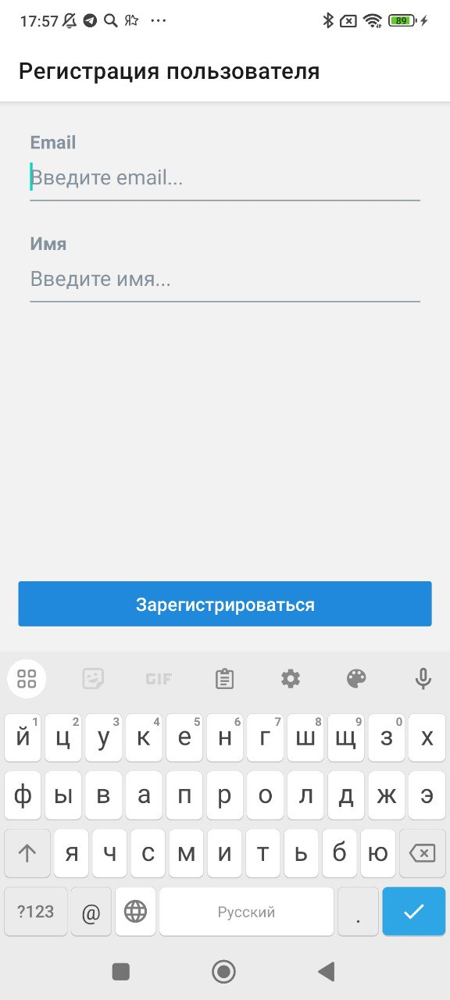
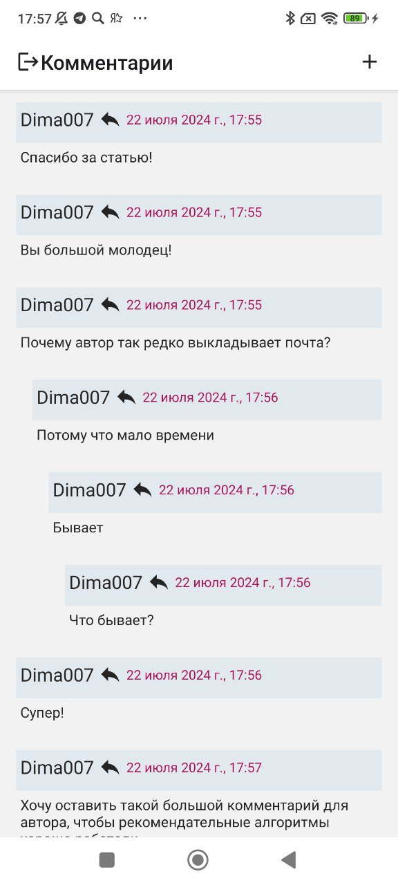
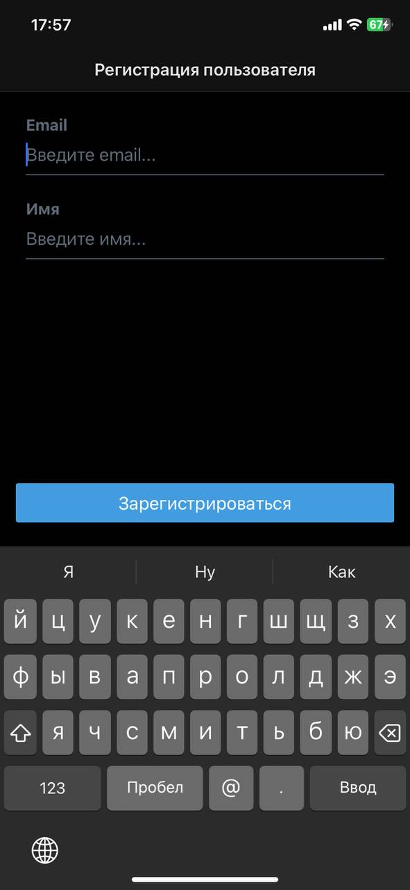

# Comments App

## Screens
<table>
  <tr>
    <td>
      
    </td>
    <td>
      
    </td>
  </tr>
  <tr>
    <td>
      
    </td>
    <td>
      
    </td>
  </tr>
</table>

## How to run?

### iOS

#### prerequires
1. Installed [XCode](https://apps.apple.com/us/app/xcode/id497799835?mt=12), [npm](https://docs.npmjs.com/downloading-and-installing-node-js-and-npm), [yarn](https://yarnpkg.com/getting-started/install), [node](https://nodejs.org/en/download/package-manager)
2. Run scripts in the project root directory

#### Steps

```shell
# step 1
yarn install
# step 2
npx expo prebuild
# step 3
npx expo run:ios --configuration release --device
```

### Android

#### prerequires
1. Installed [Android Studio](https://developer.android.com/studio), [npm](https://docs.npmjs.com/downloading-and-installing-node-js-and-npm), [yarn](https://yarnpkg.com/getting-started/install), [node](https://nodejs.org/en/download/package-manager)
2. Run scripts in the project root directory

#### Steps

```shell
# step 1
yarn install
# step 2
npx expo prebuild
# step 3
npx expo run:android --variant release --device
```

